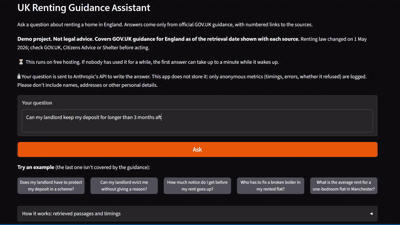
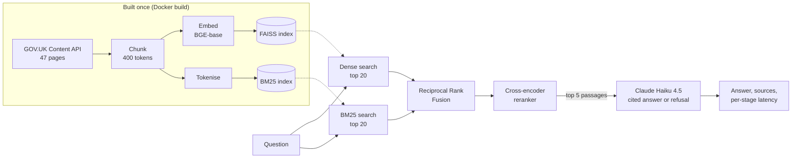

# UK Renting Guidance Assistant

A question-answering assistant for renting in England that answers only from official GOV.UK
guidance, cites its sources, and says so when the guidance does not cover a question.

[](https://github.com/MaxS140M/uk-renting-rag/actions/workflows/ci.yml)
[](LICENSE)
[](https://www.python.org/)


# Demo
 

## Results

Evaluated on 110 development questions and, once, on 20 held-out questions
([full results](eval/RESULTS.md), [error analysis](eval/ERROR_ANALYSIS.md)):

| Configuration | Recall@5 | MRR | Faithfulness | Correctness | Refusal accuracy | Median latency |
|---|---:|---:|---:|---:|---:|---:|
| Dense retrieval (baseline), dev | 67.7% | 0.463 | 88.4% | 61.6% | 100% | 3.0 s |
| Hybrid + reranker + BGE embeddings, dev | 71.7% | 0.494 | 87.2% | 65.7% | 100% | 4.0 s |
| Hybrid + reranker + BGE embeddings, **held-out** | 83.3% | 0.565 | 93.8% | 66.7% | 100% | 4.0 s |

**Headline:** the final configuration improves on the dense baseline by about 4 points on both
Recall@5 and correctness, but neither 95% interval excludes zero, so on 99 answerable
questions the gain is not statistically clear. The main weakness is false refusals: the
system declines about 15% of questions the guidance does answer, while never answering one
it should refuse.

## Architecture



- **Hybrid retrieval.** Dense embeddings find passages with the same meaning in different
  words; BM25 matches exact terms such as "section 21", "Form 4A" or "30 days". Reciprocal
  Rank Fusion merges the two candidate lists using ranks, not scores, because cosine
  similarity and BM25 scores are on incompatible scales.
- **Reranking.** A cross-encoder reads each question and passage together, which is more
  accurate than comparing separate embeddings but too slow for the whole corpus, so it only
  reorders the top 20 candidates.
- **Grounded generation.** Claude answers only from the numbered passages, cites them,
  states the retrieval date, and replies "I can't find that in the guidance" rather than
  guessing. The user's question is kept in its own tagged block, separate from the
  instructions, as a defence against prompt injection.
- **Serving.** One FastAPI server provides `POST /ask`, `GET /health` and the Gradio demo
  page. Models and indexes load once at startup. A per-IP rate limit and a daily cap on LLM
  calls keep a public demo affordable, and question text is never logged.

Every component sits behind a common interface and is switchable in configuration, which is
what made the one-change-at-a-time comparisons in the evaluation possible.

| Path | Contents |
|---|---|
| `src/rag/` | Library: chunking, retrieval (dense, BM25, hybrid), reranking, generation, evaluation |
| `app/` | FastAPI API, Gradio demo, rate limiting and the daily cap |
| `scripts/` | Data collection, indexing, question authoring, evaluation reports, deployment |
| `eval/` | Test set, experiment configs, results and error analysis |
| `data/` | Frozen snapshot of the 47 GOV.UK documents ([details](data/README.md)) |
| `tests/` | 250+ tests; the LLM is always mocked, so no test calls a paid API |

## Quick start

Requires Python 3.11+ and an [Anthropic API key](https://platform.claude.com).

```bash
git clone https://github.com/MaxS140M/uk-renting-rag.git
cd uk-renting-rag
python -m venv .venv
source .venv/bin/activate              # Windows: .venv\Scripts\activate
pip install -r requirements-dev.txt    # pinned runtime dependencies plus pytest and ruff
pip install -e . --no-deps
cp .env.example .env                   # then add your ANTHROPIC_API_KEY

python scripts/deploy/prepare_deployment.py   # download the models and build the index (a few minutes)
uvicorn app.main:app --port 7860       # demo at http://localhost:7860, API docs at /docs
```

Or ask from the command line, with any configuration from `eval/configs.yaml`:

```bash
python scripts/ask.py "Can my landlord evict me without a reason?" --config hybrid_rerank_bge
python scripts/ask.py "How much notice before a rent increase?" --config hybrid_rerank_bge --retrieval-only
```

**With Docker:**

```bash
docker build -t uk-renting-rag . && docker run -p 7860:7860 --env-file .env uk-renting-rag
```

The image bakes in the embedding model, reranker and index, runs as a non-root user and
starts without downloading anything. CI builds it on every push and checks that it loads
with no network access. The demo is not hosted publicly, but the image is ready to deploy:
[DEPLOY.md](DEPLOY.md) covers Hugging Face Spaces and other Docker hosts.

**API:**

```bash
curl -X POST http://localhost:7860/ask -H "Content-Type: application/json" \
     -d '{"question": "Does my landlord have to protect my deposit?"}'
```

returns the answer, numbered sources (title, URL, retrieval date), latency per stage and the
configuration name. Questions over 500 characters, empty questions, too many requests and API
failures all return a clear JSON error, never a stack trace.

## How the evaluation works

Details: [eval/README.md](eval/README.md).

- **Test set: 130 questions** (80 factual, 25 multi-passage, 12 informal, 13 unanswerable),
  split into 110 dev and 20 held-out, stratified by type with a fixed seed.
- **Generated by an LLM in two separate steps.** Claude Opus 5.5 wrote questions as tenants
  would ask them, seeing only the list of topics and never the passages, so questions do
  not copy the documents' wording (which would favour keyword search). In separate calls it
  read the whole corpus to find exact evidence quotes and write reference answers; the
  evidence was deliberately not found with this project's retriever, which would have hidden
  its own failures.
- **Checked automatically, not reviewed by a person.** Every quote is verified word for word
  against a frozen, committed copy of the corpus (also in CI), and 6 question types were
  corrected where the evidence disagreed. The questions and reference answers were **not**
  individually reviewed by hand, so correctness scores carry some noise from the answer key.
- **Gold evidence is a quote, not a chunk id**, mapped to chunks at run time, so one set of
  labels scores every chunk size compared.
- **One change at a time.** Seven configurations, each differing from the one it is compared
  with by a single setting (retrieval method, reranker, chunk size, embedding model), with
  95% paired bootstrap intervals for every difference.
- **Metrics.** Recall@1/5 and MRR for retrieval (free, run for every configuration);
  faithfulness, correctness and refusal accuracy from an LLM judge (Claude Sonnet 5.5) for
  the most promising configurations; latency per stage. All LLM calls are cached on disk,
  so the evaluation reproduces exactly at no cost.
- **Judge agreement.** I labelled 27 randomly sampled answers. My first, blind labels marked
  everything correct, so they could not measure agreement (kappa 0.00). Reviewing each of the
  16 disagreements, the judge was right in 20 of 25 disputed calls; agreement after that review
  is 85% for faithfulness (kappa 0.71) and 96% for correctness (kappa 0.93). That review was
  not blind, so these figures are optimistic ([details](eval/judge/agreement.md)).
- **Held-out split run once**, for the final configuration only; the script refuses a second
  run without a logged reason.

## Error analysis

From [eval/ERROR_ANALYSIS.md](eval/ERROR_ANALYSIS.md), for the final configuration on the dev
split:

- **False refusals are the biggest problem:** 15 of 99 answerable questions were refused.
- **About a third of failures are retrieval misses:** in 25 of 65 the passage holding the
  gold evidence was not among the 5 given to the model. Some of these are artefacts of having
  a single gold passage per question, as the guidance repeats rules in several places.
- **Patterns seen when reviewing answers:** social-housing rules (Awaab's Law) applied to a
  private renter; "may be" turned into "are"; a rule stretched beyond what the passage says;
  conclusions about the user's own situation that the passages do not support.

## Limitations

- **Demo project, not legal advice.** Check GOV.UK, Citizens Advice or Shelter before acting.
- **England only.** Renting law differs in Scotland, Wales and Northern Ireland.
- **A snapshot in time.** The guidance was retrieved on 1 October 2026, and renting law has
  been changing: the Renters' Rights Act 2025 replaced assured shorthold tenancies and ended
  Section 21 "no-fault" evictions from 1 May 2026. Answers show the retrieval date.
- **Only 47 GOV.UK pages**; some official content (such as the Renters' Rights Act
  Information Sheet) is published only as a PDF and is not fully included.
- **Evaluation caveats:** an LLM-generated test set not reviewed by a person, one gold passage
  per question (which understates recall), a small held-out set (one question is about 5
  points), and results measured with prompt v1 while the demo uses v2, which adds
  prompt-injection hardening.
- **Not hosted publicly.** The demo runs locally. Its rate limit and daily cap are kept in
  memory, so if it were hosted they would reset whenever the server restarted.

## Next steps

- Reduce false refusals, for example by letting the model answer the parts it can support
  and by retrieving more passages for multi-part questions.
- Allow several gold passages per question, so recall is not understated.
- Have a person review the test set (the tooling exists: `scripts/testset/review_drafts.py`).
- Re-run the evaluation with the deployed prompt (v2).
- Add a demo GIF, and host the demo publicly ([DEPLOY.md](DEPLOY.md)).

## Licence and attribution

Code: [MIT](LICENSE). The documents in `data/raw/` are GOV.UK content, Crown copyright,
used under the [Open Government Licence v3.0](https://www.nationalarchives.gov.uk/doc/open-government-licence/version/3/).

Contains public sector information licensed under the Open Government Licence v3.0.
